---
title: windows server DFS复制
date: '2025-03-030 15:00:00'
sidebar: 'auto'
categories:
- windows
tags:
- windows
publish: true
---

# **Windows Server DFS实现数据复制**

确认文件系统和卷格式。 确定要复制的文件夹，并标识使用 NTFS 文件系统格式化的卷上的任何文件夹。 DFS 复制不支持复原文件系统 (ReFS) 或 FAT 文件系统。 DFS 复制也不支持复制存储在群集共享卷上的内容。

验证防病毒兼容性。 请与防病毒软件供应商联系，确认你的防病毒软件是否与 DFS 复制兼容。

更新 AD DS 架构。 更新 AD DS 架构以包括 Windows Server 2003 R2 或更高版本架构添加项。 不能对 Windows Server 2003 R2 或更高版本架构添加项使用只读复制文件夹。

准备复制组服务器。 在计划用作复制组成员的所有服务器上安装 DFS 复制。

检查林位置。 确保复制组中的所有服务器位于同一林中。 不能跨不同林中的服务器进行复制。

### **1, 准备好两个已经加入同一个域的设备**
例如:

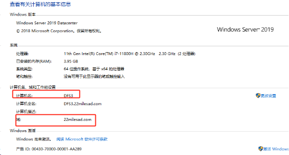

###
### **2, 两台加入域的设备后开始进行配置**
准备 CMS 默认安装后的路径 :

C:\Program Files (x86)\22MILES\Enterprise\service

可以先把两台VM都进行安装后再进行配置DFS复制

### **3, 开始安装DFS 服务**
打开服务管理器

添加角色和功能 - 基于角色或基于功能的安装

服务器角色选择： 文件和储存服务,  如下

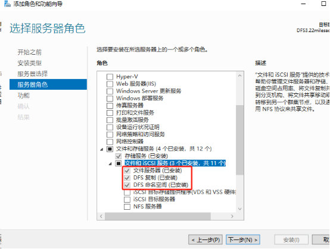

等待安装结束即可， 如果有需要重启则勾选完成后进行重启

注意 在两个设备上都需要进行安装

### **4, 开始配置DFS 服务**
打开服务管理器

本地服务器 - 右上角 - 工具 DFS Management

右击复制 - 新建复制组

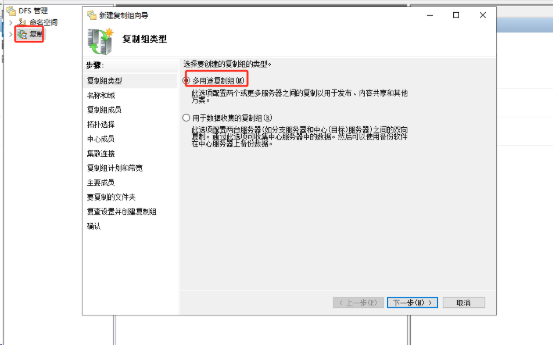

选择 多用途复制组

下一步

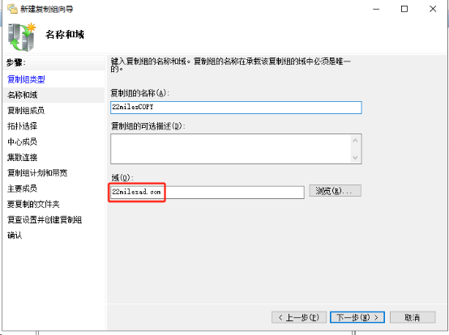

输入两个设备加入的域,  组名自定义

下一步

添加组成员

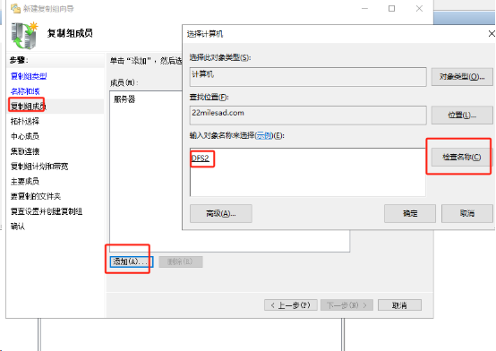

选择添加 - 在输入框中 输入加入域 与需要进行同步设备的名称, 

例如：DFS2 点击检查名称，如果存在则会进行添加

注意把需要添加的设备都添加进来

下一步

选择拓扑计划

这里选择 交错方案F

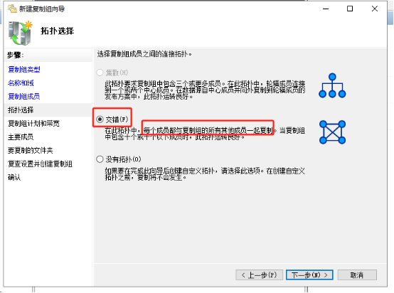

下一步

选择复制组计划和带宽

这里使用 指定带宽连续复制

带宽的大小可以根据需要进行调整

这里选择完整带宽

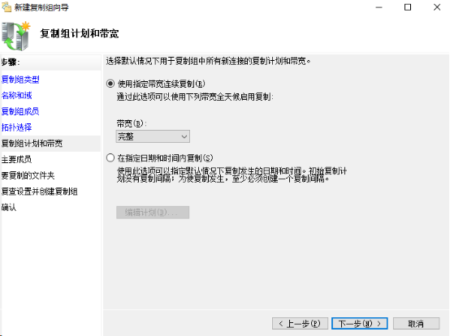

下一步

选择主要成员

这里的理解是， 如果选择交错拓扑计划，主要成员的作用在于其他成员进行 [初始化] 复制的时候将优先选择主要成员进行复制

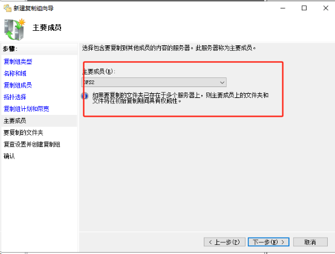

下一步

添加要进行复制的文件夹

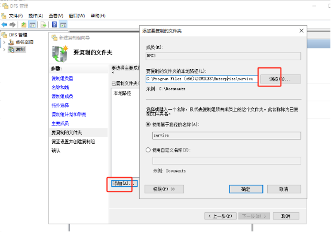

C:\Program Files (x86)\22MILES\Enterprise\service

这里选择之前安装后的生成 service路径进行复制

下一步

其他成员的复制路径

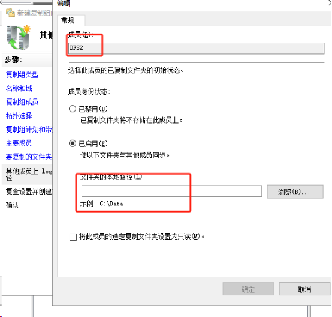

这个路径选择填写其他VM的相同路径

然后创建，没有出现错误则创建成功

### **5, 创建完成**

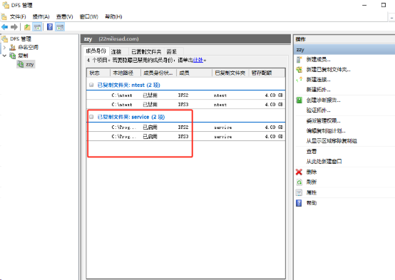

创建完成后在组下面可以看到当前复制文件夹域和成员的状态

如果要更改复制的文件路径可以把之前创建的文件夹进行禁用

然后新建已复制文件夹

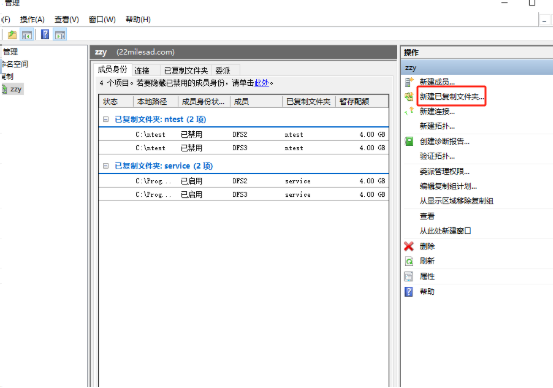

测试:

在vm1 中的复制目录新建文件,  在vm2中是否可见， vm2中打开该文件写入内容, 在vm1中是否可见

### **6, 其他**
调整带宽

编辑复制组计划 - 带宽

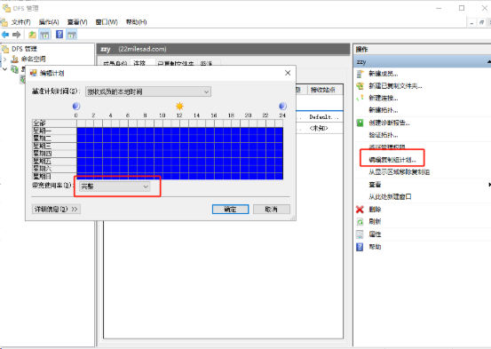

AD域下的用户应该给权限 修改隶属于

参考连接：

<https://blog.csdn.net/kaml200626/article/details/123332300>

<https://blog.csdn.net/Junson142099/article/details/108882157>

